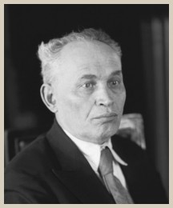

---
search:
  exclude: true
---

# Комментарии к «Капиталу» К. Маркса

## Автор

- [Розенберг, Давид Иохелевич](https://ru.wikipedia.org/wiki/%D0%A0%D0%BE%D0%B7%D0%B5%D0%BD%D0%B1%D0%B5%D1%80%D0%B3,_%D0%94%D0%B0%D0%B2%D0%B8%D0%B4_%D0%98%D0%BE%D1%85%D0%B5%D0%BB%D0%B5%D0%B2%D0%B8%D1%87)

## Замечания

- Электронная версия подготовлена без сносок.
- Большие абзацы разбиты на более мелкие для удобства чтения.
- Поиск работает только по названиям страниц и заголовкам/подзаголовкам.
- Электронная версия подготовлена по электронной версии книги: Розенберг Д. И., Комментарии к «Капиталу» К. Маркса. — М.: Экономика, 1984. — 720 с.
